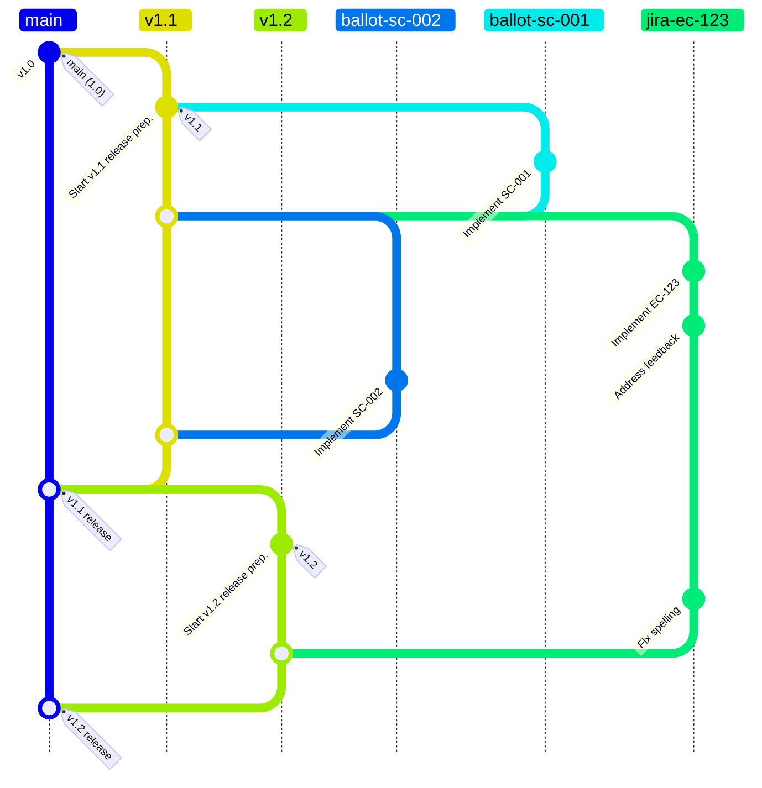

# CP/CPS Version Control Process

This document outlines the version control process for updating the Entrust CP/CPS documents using Git.

## Branching Strategy

- **Main Branch**: The `main` branch contains the latest published version of CP/CPS documents (e.g., version 1.0).
- **Release Branches**: For each upcoming version, create a new branch from `main` named `vX.Y` (e.g., `v1.1` for version 1.1). Release branches are where approved changes accumulate until the release is finalized.
- **Feature Branches**: Each change is developed in a separate feature branch created from the relevant release branch (e.g., `v1.1`). Feature branch names should be descriptive and lowercase (e.g., `ballot-sc-001` or `jira-ec-123`).

## Process Steps

1. **Create Release Branch**: When preparing a new version, create a release branch from `main` (e.g., `v1.1`). This branch serves as the staging area for the next release.

2. **Develop Changes in Feature Branches**: For each change:
   - Create a feature branch from the release branch (e.g., `v1.1`) with a clear name, such as `ballot-sc-001` or `jira-ec-123`.
   - Implement the change, and submit it for review and approval.

3. **Review and Approval**: Feature branches must be reviewed and approved before they can be merged into the release branch. Once approved, changes are queued in the release branch for the next version. This ensures only vetted changes are included in a release.

4. **Adjust Target for Deferred Changes**: If a feature (e.g., `jira-ec-123`) is deferred to a future release, update its target branch to the subsequent release branch (e.g., `v1.2`).

5. **Merge into Release Branch**: Once all changes for the release are confirmed, approved feature branches are merged into the release branch (e.g., `v1.1`). Feature branches can be merged in any order, allowing flexibility in release planning.

6. **Protect Release Branch**: Release branches (e.g., `v1.1`, `v1.2`) are protected, requiring pull requests and approvals for any modifications.

7. **Final Merge to Main**: Once the release is complete, merge the release branch (e.g., `v1.1`) into `main` for publication. No additional approvals are needed for this final merge, as all changes in the release branch have been reviewed.

## Example Git Flow

The diagram below visualizes the process, showing `ballot-sc-001` and `ballot-sc-002` as approved changes merged into `v1.1`. The feature `jira-ec-123` is initially developed from `v1.1` but ultimately deferred to `v1.2`:

This diagram shows:
- `main` branch with the published versions.
- `v1.1` branch for the 1.1 release, where feature branches `ballot-sc-001` and `ballot-sc-002` are approved and merged.
- `jira-ec-123` is initially created from `v1.1` but later retargeted to `v1.2`, so it merges into `v1.2` instead.
- After all changes are finalized, `v1.1` is merged into `main` to release version 1.1. Later, `v1.2` follows the same process.
